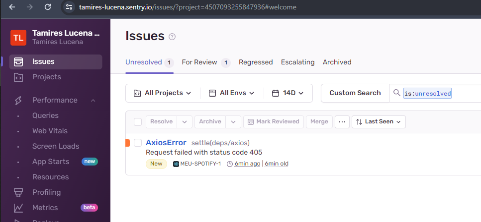
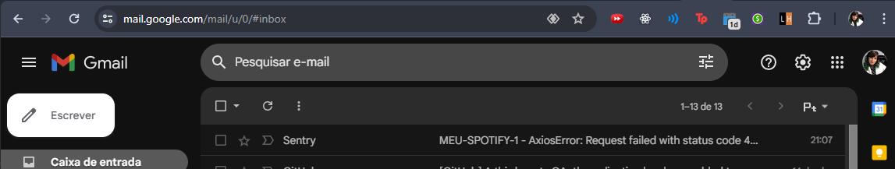

<!-- PROJECT LOGO -->
 

  <h2 align="center">Meu Spotify</h2>

  

    Interface com informações do spotify 
     
  

<!-- TABLE OF CONTENTS -->

  
Tabela de conteúdos

  <ol>
    <li>
      <a href="#sobre-o-desafio">Sobre o Desafio</a>
      <ul>
        <li><a href="#requisitos-obrigatórios">Requisitos obrigatórios</a></li>
      </ul>
      <ul>
        <li><a href="#bônus">Bônus</a></li>
      </ul>
    </li>
    <li>
      <a href="#utilizando-a-ferramenta">Utilizando a ferramenta</a></li>
      <ul>
        <li><a href="#observações">Observações</a></li>
      </ul>
      <ul>
        <li><a href="#evidências">Evidências</a></li>
      </ul>
    </li>
  </ol>

<!-- ABOUT THE PROJECT -->

## Sobre o Desafio

### Requisitos obrigatórios

- [x] Seguimentação de commits
- [x] Lint
- [x] Autenticação via Spotify
- [x] Listar artistas que mais ouvimos
- [x] Listar albuns desses artistas
- [x] Listar as playlists do usuário
- [x] Criar uma nova playlist
- [x] Exibir os dados do usuário
- [x] Deploy da aplicação
- [x] Utilizar paginação (scroll infinito ou não)
  > Feito na pagina de playlists para demonstração de funcionamento.
- [x] Funcionamento offline
  > Para os casos em que a api do spotify estiver offline após autenticação, o resultado da ultima requisição bem sucedida será exibido.
- [x] Testes unitários
  > Testes para o componente denominado "GreenButton" para demonstração.

### Bônus

- [x] CI/CD

  > Configurado abertura de PR automatico para main a partir das branches: develop ou que comecem com feature ou release

  > Configurado o passo de testes para subidas direto na branch main

- [x] Integração com Sentry
  > Captura de excessões de requisições para api do spotify
- [ ] Testes E2E
- [ ] Responsividade (celular e tablet)
- [ ] Qualidade de código (Sonarqube)
- [ ] PWA

### Tecnologias e Recursos

O projeto foi criado usando as tecnologias:

- [Vite]
  Ferramenta para inicialização e compilação do projeto.

- [TypeScript]
  Linguagem escolhida para melhor organização e manutenção.

- [Jest]
  Para realização de testes;

- [Vercel]
  Ferramenta de hospedagem que ja oferece algumas facilidades para publicação de projetos em react, vite e github;

## Utilizando a ferramenta

1. Acesse: <a href="https://meu-spotify-six.vercel.app/login">https://meu-spotify-six.vercel.app/login</a>;

2. Autorize a aplicação a acessar alguns dados de sua conta;

> Veja seus artistas mais ouvidos entre outras funcionalidades.

### Observações

> Para que o usuário consiga utilizar a ferramenta, é necessario a concessão de acesso para o email vinculado a conta spotify deste usário previamente realizada na ferramenta de desenvolvedor do spotify. Esse passo se fez necessário porque, sendo o desafio atual ainda um projeto considerado em desenvolvimento, a liberação para o publico geral só é possível após analise e aprovação do time de complience do spotify.

### Evidências

> Anexos do aviso recebido no Sentry - inclusive via email - sobre a excessão captura na aplicação.

